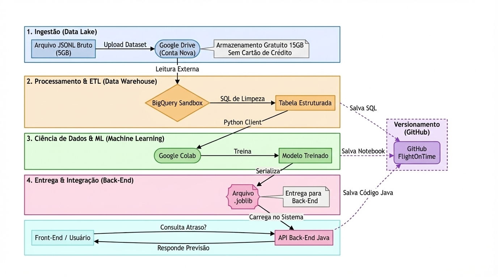

# ✈️ Data Science — flight-on-time

Módulo responsável por análise de dados, preparação, criação do modelo preditivo e disponibilização do modelo através de um **microserviço FastAPI**.

## 🗺️ Arquitetura do Projeto (End-to-End)

### Visão Geral da Arquitetura O fluxo de dados foi estruturado em quatro camadas principais:
Ingestão: Coleta de dados brutos e armazenamento em Google Cloud Storage.
Processamento & ETL: Limpeza e estruturação dos dados utilizando BigQuery e SQL.
Ciência de Dados & ML: Desenvolvimento do modelo de classificação (EDA, Feature Engineering e Treinamento).
Entrega & Integração: Exportação do artefato final para disponibilização via API.

O objetivo é prever se um voo será **Pontual (0)** ou **Atrasado (1)** com base em seus atributos.

---

# 📘 1. Objetivos do Módulo de Data Science

* Realizar EDA (análise exploratória dos dados)
* Preparar features relevantes
* Treinar um modelo de classificação simples e eficiente
* Avaliar métricas como:

  * Acurácia
  * Precision
  * Recall
  * F1-Score
* Exportar o modelo (`.joblib`)
* Carregar o modelo no microserviço FastAPI
* Disponibilizar o endpoint `/predict-model` para o backend Java

---

# 🧱 2. Estrutura da pasta datascience

```
🧱 2. Estrutura da pasta datascience

datascience
│── notebooks/        → Notebooks de EDA, Feature Engineering e Treinamento
│── docs/             → Diagrama de arquitetura e documentação visual
│── model/            → Documentação e link para o modelo (.joblib) no Drive
│── sql/              → Scripts de extração e refino no BigQuery
│── service/          → Microserviço FastAPI (produção)
```

---

# 🧠 3. Tecnologias Utilizadas

* Python **3.10**
* Pandas 2.x
* Scikit-Learn 1.4+
* FastAPI
* Uvicorn
* Joblib
* Jupyter Notebook

---

# 🧪 4. Pipeline de Desenvolvimento

A equipe de Data Science deve seguir este fluxo:

### 🔹 1. Exploração dos dados (EDA)

* Leitura do dataset
* Identificação de linhas faltantes
* Estatísticas básicas
* Distribuição de atrasos
* Análise das features:

  * companhia aérea
  * aeroporto
  * horário
  * dia da semana
  * distância

Tudo isso é feito no notebook `eda_model.ipynb`.

---

### 🔹 2. Feature Engineering

Criar variáveis como:

* `hora_do_dia`
* `dia_da_semana`
* `tipo_companhia` (bandeira / low cost)
* `volume_origem` / `volume_destino`

---

### 🔹 3. Treinamento do Modelo

Modelos sugeridos:

* `LogisticRegression`
* `RandomForestClassifier` (recomendado pela robustez)

Salvar o modelo treinado:

```python
import joblib
joblib.dump(model, "../model/modelo_voo.joblib")
```

---

### 🔹 4. Avaliação

Gerar métricas:

```python
from sklearn.metrics import classification_report
print(classification_report(y_test, y_pred))
```

Plotar matriz de confusão (opcional, recomendado).

---

### 🔹 5. Preparar o Microserviço FastAPI

O arquivo `app.py` deve:

* Carregar o modelo `.joblib`
* Receber entrada no formato JSON
* Converter features
* Rodar a previsão
* Retornar resultado + probabilidade

Exemplo:

```python
@app.post("/predict-model")
def predict(data: dict):
    x = processar_inputs(data)
    pred = modelo.predict([x])[0]
    prob = modelo.predict_proba([x])[0][1]
    return {"previsao": int(pred), "probabilidade": float(prob)}
```

---

# ⚙️ 5. Como Rodar Localmente o Microserviço

Dentro da pasta:

```
cd datascience/service
pip install -r requirements.txt
uvicorn app:app --reload --port 8000
```

Acesso:

```
http://localhost:8000
```

Endpoint principal:

```
POST /predict-model
```

---

# 📦 6. Arquivo requirements.txt

Inclui dependências essenciais:

```
fastapi
uvicorn
pandas
scikit-learn
joblib
```

---

# 🐳 7. Rodando com Docker

O microserviço será empacotado via docker-compose (configuração criada mais adiante).

Estrutura típica:

```dockerfile
FROM python:3.10

WORKDIR /app
COPY . .
RUN pip install -r requirements.txt
CMD ["uvicorn", "app:app", "--host", "0.0.0.0", "--port", "8000"]
```

---

# ☁️ 8. Deploy na OCI (resumo rápido)

O guia completo está em:

```
oci/README_OCI.md
```

Processo:

1. Subir VM Ubuntu
2. Instalar Docker + Docker Compose
3. Configurar portas
4. Rodar docker-compose
5. Backend se conecta via HTTP ao FastAPI na OCI

---

# 📌 9. Entregáveis do Time de DS

* Notebook completo (EDA → Modelo → Avaliação → Exportação)
* Arquivo `.joblib`
* Microserviço funcionando localmente
* Microserviço funcionando na OCI
* Documentação clara

---

# 🙌 10. Responsável pela área de DS

Documento destinado ao time de análise e modelagem.
