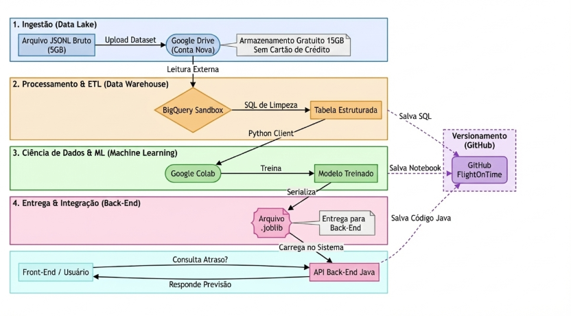
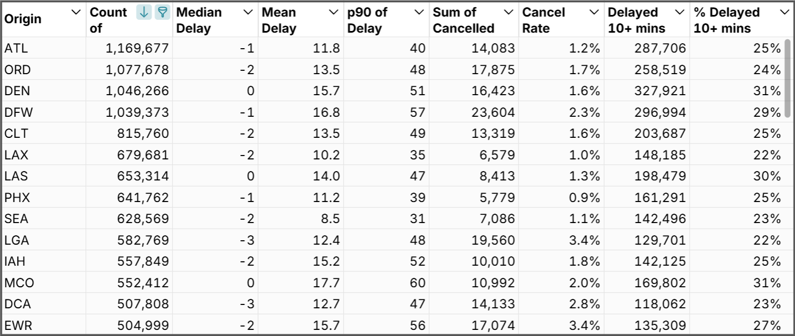
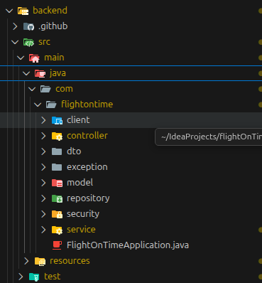

# ✈️ Flight On Time
## Previsão Inteligente de Atrasos de Voos com Machine Learning

> Transformando dados em decisões antecipadas no transporte aéreo.

---

## 🖼️ Visão Geral


---

## 🔌 Projeto em Funcionamento (ambiente local)

**Frontend**
http://127.0.0.1:5500/frontend/index.html

**Swagger / API**
http://localhost:8080/swagger-ui/index.html#/


---

## ❌ O Problema

A maioria dos sistemas reage depois que o atraso acontece.
Isso gera custos, conexões perdidas e má experiência para o passageiro.

Nosso foco é **antecipar o risco**.


---

## 🎯 Objetivo

Criar um MVP que:
- Recebe dados de voo
- Usa Machine Learning
- Retorna previsão + probabilidade
- Registra histórico
- Funciona de ponta a ponta

---

## 🏗️ Arquitetura End-to-End



Fluxo:
Frontend  
↓  
API Java (Spring Boot)  
↓  
Microserviço ML (FastAPI)  
↓  
Modelo Treinado  
↓  
PostgreSQL  

---

## 🧠 Data Science



- Dataset Kaggle (2024)
- EDA + Feature Engineering
- Modelo de classificação
- Métricas: Accuracy, Precision, Recall, F1
- Exportação em `.joblib`

---

## 🔌 Microserviço ML

Endpoint:
```http
POST /predict-model
```

Resposta:
```json
{
  "previsao": "Atrasado",
  "probabilidade": 0.78
}
```

---

## ☕ Backend Java



- Endpoint /predict
- Validação
- Integração ML
- Persistência
- Swagger

---

## 👥 Nosso Time


- Darlei Oliveira Mota — Tech Lead / Backend  
- Sueli da Hora Moreira — Data Scientist  
- Antonio Neto — Data Scientist  
- Tiago Blanco — Backend  
- Marco Antonio Prado Nunes — Backend  
- Bruno Sales — Backend  
- Márcio Pires Barboza — Backend  

---

## 📊 Status

✔ Arquitetura  
✔ Modelo treinado  
✔ Integração  
✔ Swagger  
⬜ Deploy cloud  

---

## ✈️ Conclusão

Machine Learning aplicado a um problema real,
com arquitetura moderna e MVP funcional.

> **Antecipar atrasos é antecipar decisões.**
